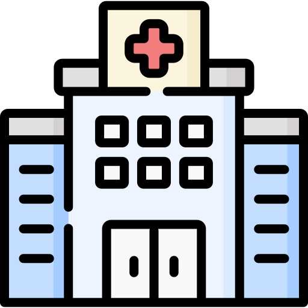
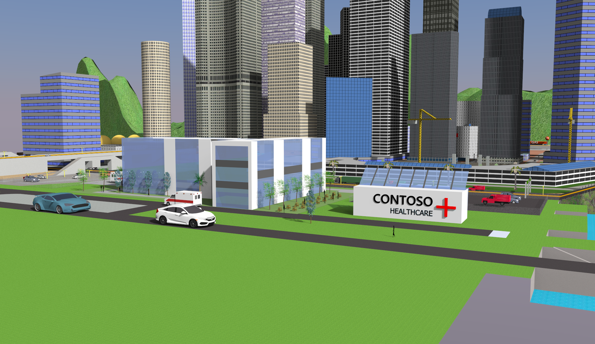

[LinkedIn](https://www.linkedin.com/in/nikunj-phutela/)[linkedin-shield]][linkedin-url]
# Hospital of the Future-Digital Twin

<!-- PROJECT LOGO -->
<br />
<p align="center">
  <a href="https://github.com/othneildrew/Best-README-Template">
    
  </a>
  <h3 align="center">Digital Twin </h3>
  <p align="center">
    Provides the admin of the hospital complete control over all aspects of the hospital.
  </p>
</p>

## Table of contents
* [About this project](#about-this-project)
* [Suggested solution](#suggested-solution)
* [Purpose](#purpose)
* [Setting up the project](#setting-up-the-project) 
* [Eventual impact](#eventual-impact)

## About this project:
Digital Twins have become increasingly popular in the last few years because of their capabilities of influencing design build operations. Digital twin refers to a digital replica of assets in the building, the various rooms and sensors among other entities.  
In our case, building a digital twin of the hospital will help create an environment, which can be controlled by the user and provides additional Insights for effective operation of edge devices. In this context, edge devices refer to the drone and the conversational chat bot.  
There is need to monitor the data from sensors, such as the occupancy sensors, temperature sensors, energy consumption, etc. across the building to get an insight into the various factors affecting the facility, which can effectively be provided by the digital twin.



## Suggested solution: 
The digital twin service provided by Azure when paired along with the 3-D visualization of the hospital helps build a digital twin of the facility. 
1. A digital twin of the hospital premises is built, and the management of all sensors across the facility is done with the help of the IoT Hub. The sensor data available via the Azure IoT hub is paired with edge devices and can help provide an overview on aspects such as temperature, occupancy status and more.

2. The mapping of each floor is carried out using 2-D CAD drawings which are further converted into Azure indoor maps using the Creator module.
As mentioned earlier, the digital twin not only provides a visualization of the building, but also provides data to edge devices such as the drone and the conversational chatbot to create additional digital solutions. The edge devices with the help of the Azure indoor maps can help patients with their queries and also navigate around the facility and monitor all aspects such as COVID-19 guidelines, among others. All these aspects combined provides an end to end identical digital model of the physical hospital enabling the ability to test certain technologies and scenarios via simulations prior to implementing it in the real life facility.

## Setting up the project

This project contains 2 samples for working with Azure Digital Twins:
* A **building scenario** sample written in .NET. Can be used to set up and simulate a full end-to-end scenario with Azure Digital Twins
* A **deployment script** written in PowerShell. Can be used to deploy and set [AAD](https://docs.microsoft.com/azure/active-directory/fundamentals/active-directory-whatis) permissions for an Azure Digital Twins instance.

Get the samples by downloading this repository as a ZIP file to your machine.

### Sample project contents
The sample repo contains:

| File/folder | Description |
| --- | --- |
| `AdtSampleApp` | For the building scenario. Contains a sample client application built to interact with Azure Digital Twins, as well as an Azure Functions app with two functions (*ProcessDTRoutedData* and *ProcessHubToDTEvents*) that are used to route data between Azure Digital Twins and other external services. |
| `DeviceSimulator` | For the building scenario. Simulator for a that generates telemetry events. The simulated device is a thermostat that sends temperature telemetry every ~5 seconds. |
| `scripts` | For the deployment script. Contains *deploy.ps1*.

## Prerequisites

### For the building scenario:
These samples were developed and expected to run in Visual Studio 2019. Ensure you have installed Visual Studio 2019 version **16.5.1XXX or later** on your development machine. If you have an older version installed already, you can open the Visual Studio Installer app on your machine and follow the prompts to update your installation.

The links to the official documentation are:
### Building scenario:
There are two possible sets of instructions for working with this sample. 
* [*Tutorial: Explore the basics with a sample client app*](https://docs.microsoft.com/azure/digital-twins/tutorial-command-line-app)
* [*Tutorial: Connect an end-to-end solution*](https://docs.microsoft.com/azure/digital-twins/tutorial-end-to-end)

### Deployment script:
Instructions for running the script, and manual description of the automated steps within the script, are found in [*How-to: Create an Azure Digital Twins instance*](https://docs.microsoft.com/azure/digital-twins/how-to-set-up-instance).

### Deploying the sensors:
Instructions for deploying the sensors, and manual description of the steps to be performed, are found in [*Remotely Monitor and Control Devices with Azure IoT*](https://microsoftlearning.github.io/AZ-220-Microsoft-Azure-IoT-Developer/Instructions/Labs/LAB_AK_15-remotely-monitor-and-control-devices.html#simplified-lab-conditions)

### Steps to run:

1. The instructions for creating the digital twin are included in the [Azure Digital Twins documentation](https://docs.microsoft.com/azure/digital-twins/).
2. Once the digital twin has been created, navigate to the AdtSampleApp folder, and open the solution in Visual Studio.
3. Once the solution is open, create a copy of the serviceConfig.json.TEMPLATE file and name it serviceConfig.json, and fill in the placeholders for the ClientID, TenantID, and the service URL for the digital twin, noted whilst creating the digital twin.
4. Once the placeholders have been filled, run the project, and see that it creates the room and the thermostats.
5. Now move onto the Azure portal, and navigate to the 'Creation of sensors' folder in demo scripts. And further move onto the setup folder.
6. Run the sensor1.azcli file using ./sensor1.azcli, and fill in the placeholders.
7. Once the sensors have been deployed, open sensor1 and navigate to cheesecavedevice1, fill in the placeholders, and use dotnet run to build the solution and see telemetry being sent to the IoT Hub.
9. Now navigate to cheesecaveoperator1, and fill in the placeholders, and use dotnet run to build the solution, and manually control the temperature in the digital twin.
10. For visualisation in a web application, proceed [here](#visualisation-in-a-webapp). 

## Visualisation in a webapp:

This repo contains code for a web application, which can read temperature and humidity data from IoT Hub and show the real-time data in a line chart on the web page.

This tutorial, also published [here](https://docs.microsoft.com/en-us/azure/iot-hub/iot-hub-live-data-visualization-in-web-apps), shows how to set up a nodejs website to visualize device data streaming to an [Azure IoT Hub](https://azure.microsoft.com/en-us/services/iot-hub) using the [event hub SDK](https://www.npmjs.com/package/@azure/event-hubs). In this tutorial, you learn how to:

- Create an Azure IoT Hub
- Configure your IoT hub with a device, a consumer group, and use that information for connecting a device and a service application
- On a website, register for device telemetry and broadcast it over a web socket to attached clients
- In a web page, display device data in a chart

If you don't have an Azure subscription, create a [free account](https://azure.microsoft.com/free/) before you begin.

> You may follow the manual instructions below, or refer to the Azure CLI notes at the bottom to learn how to automate these steps.

### Sign in to the Azure portal

Sign in to the [Azure portal](https://portal.azure.com/).

### Create and configure your IoT hub

1. [Create](https://portal.azure.com/#create/Microsoft.IotHub), or [select an existing](https://portal.azure.com/#blade/HubsExtension/BrowseResourceBlade/resourceType/Microsoft.Devices%2FIotHubs), IoT hub.
    - For **Size and Scale**, you may use "F1: Free tier".

1. Select the **Settings | Shared access policies** menu item, open the **service** policy, and copy a connection string to be used in later steps.

1. Select **Settings | Built-in endpoints | Events**, add a new consumer group (e.g. "monitoring"), and then change focus to save it. Note the name to be used in later steps.

1. Select **IoT devices**, create a device, and copy device the connection string.

### Send device data

- For quickest results, simulate temperature data using the [Raspberry Pi Azure IoT Online Simulator](https://azure-samples.github.io/raspberry-pi-web-simulator/#Getstarted). Paste in the **device connection string**, and select the **Run** button.

- If you have a physical Raspberry Pi and BME280 sensor, you may measure and report real temperature and humidity values by following the [Connect Raspberry Pi to Azure IoT Hub (Node.js)](https://docs.microsoft.com/en-us/azure/iot-hub/iot-hub-raspberry-pi-kit-node-get-started) tutorial.

### Run the visualization website

Clone this repo. For a quick start, it is recommended to run the site locally, but you may also deploy it to Azure. Follow the corresponding option below.

### Inspect the code

Server.js is a service-side script that initializes the web socket and event hub wrapper class, and provides a callback to the event hub for incoming messages to broadcast them to the web socket.

Scripts/event-hub-reader.js is a service-side script that connects to the IoT hub's event hub using the specified connection string and consumer group, extracts the DeviceId and EnqueuedTimeUtc from metadata, and then relays message using the provided callback method.

Public/js/chart-device-data.js is a client-side script that listens on the web socket, keeps track of each DeviceId, and stores the the last 50 points of incoming device data. It then binds the selected device data to the chart object.

Public/index.html handles the UI layout for the web page, and references the necessary scripts for client-side logic.

### Run locally

1. To pass parameters to the website, you may use environment variables or parameters.
    - Open a command prompt or PowerShell terminal and set the environment variables **IotHubConnectionString** and **EventHubConsumerGroup**.

        > Syntax for Windows command prompt is `set key=value`, PowerShell is `$env:key="value"`, and Linux shell is `export key="value"`.

    - Or, if you are debugging with [VS Code](https://code.visualstudio.com/docs/nodejs/nodejs-debugging), you can edit the launch.json file and add these values in the env property.

        ```json
        "env": {
            "NODE_ENV": "local",
            "IotHubConnectionString": "<your IoT hub's connection string>",
            "EventHubConsumerGroup": "<your consumer group name>"
        }
        ```

1. In the same directory as package.json, run `npm install` to download and install referenced packages.

1. Run the website one of the following ways:
    - From the command-line (with environment variables set), use `npm start`
    - In VS Code, press F5 to start debugging

1. Watch for console output from the website.

1. If you are debugging, you may set breakpoints in any of the server-side scripts and step through the code to watch the code work.

1. Open a browser to <http://localhost:3000>.

### Use an Azure App Service

The approach here is to create a website in Azure, configure it to deploy using git where it hosts a remote repo, and push your local branch to that repo.

> Note: Do not forget to delete these resources after you are done, to avoid unnecessary charges.

1. Create a [Web App](https://ms.portal.azure.com/#create/Microsoft.WebSite).
    - OS: Windows
    - Publish: Code
    - App Service Plan: choose the cheapest plan (e.g. Dev / Test | F1)

1. Select **Settings | Configuration**
    1. Select **Application settings** and add key/value pairs for:
        - Add **IotHubConnectionString** and the corresponding value.
        - Add **EventHubConsumerGroup** and the corresponding value.
    1. Select **General settings** and turn **Web socksets** to **On**.

1. Select **Deployment Options**, and configure for a **Local Git** to deploy your web app.

1. Push the repo's code to the git repo URL in last step with:
    - In the **Overview** page, find the **Git clone URL**, using the **App Service build service** build provider. Then run the following commands:

        ```cmd
        git clone https://github.com/Azure-Samples/web-apps-node-iot-hub-data-visualization.git
        cd web-apps-node-iot-hub-data-visualization
        git remote add webapp <Git clone URL>
        git push webapp master:master
        ```

    - When prompted for credentials, select **Deployment Center | Deployment Credentials** in the Azure portal and use the auto-generated app credentials, or create your own.

1. After the push and deploy has finished, you can view the page to see the real-time data chart. Find the URL in **Overview** in the Essentials section.

## Eventual impact:
The eventual impact of the digital twin will be to gain a realistic simulation of the hospital and its associated entities, along with providing full control of the building to the user, while also providing navigation and other functionalities to edge devices such as the drone, and the conversational bot.
