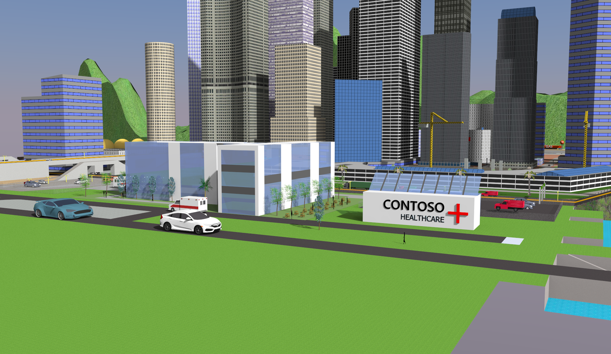

# Digital Twin
Digital Twins have become increasingly popular in the last few years because of their capabilities of influencing design build operations. Digital twin refers to a digital replica of assets in the building, the various rooms and sensors among other entities.  
In our case, building a digital twin of the hospital will help create an environment, which can be controlled by the user and provides additional Insights for effective operation of edge devices. In this context, edge devices refer to the drone and the conversational chat bot.  
There is need to monitor the data from sensors, such as the occupancy sensors, temperature sensors, energy consumption, etc. across the building to get an insight into the various factors affecting the facility, which can effectively be provided by the digital twin.

# Suggested solution: 
The digital twin service provided by Azure when paired along with the 3-D visualization of the hospital helps build a digital twin of the facility. 
1.A digital twin of the hospital premises is built, and the management of all sensors across the facility is done with the help of the IoT Hub. The sensor data available via the Azure IoT hub is paired with edge devices and can help provide an overview on aspects such as temperature, occupancy status and more.
2. The mapping of each floor is carried out using 2-D CAD drawings which are further converted into Azure indoor maps using the Creator module.
As mentioned earlier, the digital twin not only provides a visualization of the building, but also provides data to edge devices such as the drone and the conversational chatbot to create additional digital solutions. The edge devices with the help of the Azure indoor maps can help patients with their queries and also navigate around the facility and monitor all aspects such as COVID-19 guidelines, among others. All these aspects combined provides an end to end identical digital model of the physical hospital enabling the ability to test certain technologies and scenarios via simulations prior to implementing it in the real life facility.

# Create the Azure Digital Twin 

To create a new instance of the digital twin, follow the steps on this link: https://docs.microsoft.com/en-us/azure/digital-twins/how-to-set-up-instance-scripted

To create the various sensors in the digital twin, follow this tutorial: https://microsoftlearning.github.io/AZ-220-Microsoft-Azure-IoT-Developer/Instructions/Labs/LAB_AK_15-remotely-monitor-and-control-devices.html#simplified-lab-conditions

This creates the digital twin of the Contoso Healthcare facility.

To visualise the data in a web application, follow this tutorial: https://docs.microsoft.com/en-us/azure/iot-hub/iot-hub-live-data-visualization-in-web-apps

# Samples for Azure Digital Twins

Azure Digital Twins is a developer platform for next-generation IoT solutions that lets you create, run, and manage digital representations of your business environment, securely and efficiently in the cloud. With Azure Digital Twins, creating live operational state representations is quick and cost-effective, and digital representations stay current with real-time data from IoT and other data sources.

For more information about Azure Digital Twins and its key concepts, see the [Azure Digital Twins documentation](https://docs.microsoft.com/azure/digital-twins/).

## Purpose

This project contains 2 samples for working with Azure Digital Twins:
* A **building scenario** sample written in .NET. Can be used to set up and simulate a full end-to-end scenario with Azure Digital Twins
* A **deployment script** written in PowerShell. Can be used to deploy and set [AAD](https://docs.microsoft.com/azure/active-directory/fundamentals/active-directory-whatis) permissions for an Azure Digital Twins instance

## Setup

Get the samples by downloading this repository as a ZIP file to your machine.

## Sample project contents
The sample repo contains:

| File/folder | Description |
| --- | --- |
| `AdtSampleApp` | For the building scenario. Contains a sample client application built to interact with Azure Digital Twins, as well as an Azure Functions app with two functions (*ProcessDTRoutedData* and *ProcessHubToDTEvents*) that are used to route data between Azure Digital Twins and other external services. |
| `DeviceSimulator` | For the building scenario. Simulator for a that generates telemetry events. The simulated device is a thermostat that sends temperature telemetry every ~5 seconds. |
| `scripts` | For the deployment script. Contains *deploy.ps1*.

## Prerequisites

#### For the building scenario:
These samples were developed and expected to run in Visual Studio 2019. Ensure you have installed Visual Studio 2019 version **16.5.1XXX or later** on your development machine. If you have an older version installed already, you can open the Visual Studio Installer app on your machine and follow the prompts to update your installation.

#### For the deployment script:
None

## Instructions

The instructions for working with these samples are included in the [Azure Digital Twins documentation](https://docs.microsoft.com/azure/digital-twins/).

#### Building scenario:
There are two possible sets of instructions for working with this sample.
* [*Tutorial: Explore the basics with a sample client app*](https://docs.microsoft.com/azure/digital-twins/tutorial-command-line-app)
* [*Tutorial: Connect an end-to-end solution*](https://docs.microsoft.com/azure/digital-twins/tutorial-end-to-end)

#### Deployment script:
Instructions for running the script, and manual description of the automated steps within the script, are found in [*How-to: Create an Azure Digital Twins instance*](https://docs.microsoft.com/azure/digital-twins/how-to-set-up-instance).

# Eventual impact:
The eventual impact of the digital twin will be to gain a realistic simulation of the hospital and its associated entities, along with providing full control of the building to the user, while also providing navigation and other functionalities to edge devices such as the drone, and the conversational bot.
